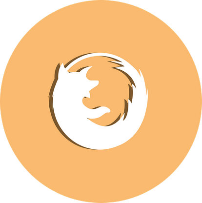

# General information



### Name
Sergej Bopp

### Contacts

* Telegram: send_text
* Skype: hp.zstyle

# About Me

I am currently taking RS-School and Yandex.Praktikum courses. My German level is **B1** and my English barely reaches **A2** at the moment. However, I am working on improving my language skills on a daily basis.

# Skills

* HTML & CSS
  * Adaptive
  * Responsive
  * Semantic
* BEM
  * Nested
  * Flat
  * Flex
* JavaScript
  * Basic
  * VueJS
* Working with layouts
  * Figma
  * Adobe Photoshop

# Code example
```javascript
  const smiley = '(o゜▽゜)o☆';
  console.log(`hello world ${smiley}`);
  
  // funny smiley, isn't it?
```

# Education

* **University, specialisation: Computer software and automated systems (specialist).**
* **RS-School: Stage 1 (till now)**
* **Yandex.Praktikum: Web-development (till now)**

# Language skills

* **English: A1-A2**
* **Deutsch: B1**